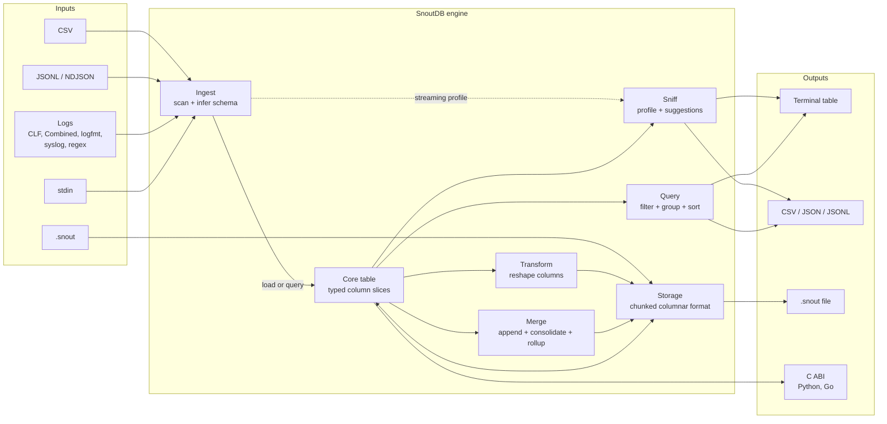
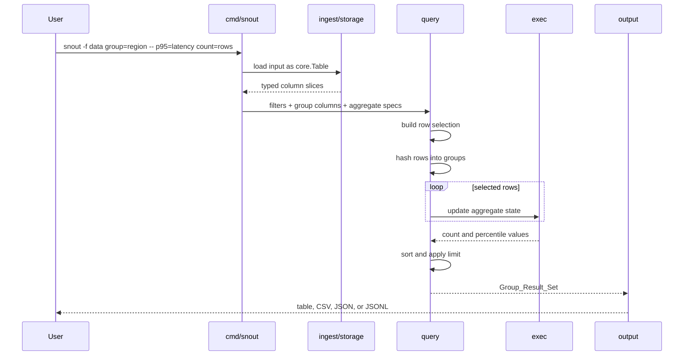
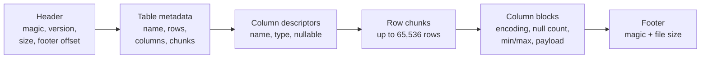
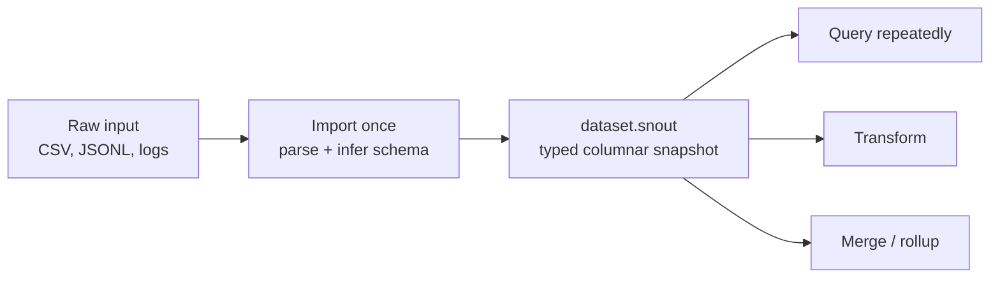

# SnoutDB

[](https://github.com/jacovinus/snoutdb/actions/workflows/ci.yml)


> **From an unfamiliar file to a useful query in one command.**

Most data tools are excellent once you know the schema and the question.
SnoutDB targets the step before that.

Point it at an unfamiliar CSV, JSONL, or log file. `sniff` infers types,
classifies columns as timestamps, identifiers, dimensions, or metrics, profiles
their values, and prints valid SnoutDB commands to investigate next.

```bash
./snout sniff -f requests.csv
```

```text
roles
-----
timestamps:  1
dimensions:  2
metrics:     3

column      type       role       distinct  details
----------  ---------  ---------  --------  ---------------------------------
region      String     Dimension         2  top: eu-west (3), us-east (3)
latency_ms  Int64      Metric            6  min=27 mean=169.83 max=441

suggested queries
-----------------
1. compare latency_ms across region
   ./snout -f requests.csv group=region -- avg=latency_ms count=rows \
     --sort avg=latency_ms desc --limit 10
```

This is not a claim that SnoutDB replaces DuckDB, Miller, qsv, VisiData, or
`jq`. It is a focused reconnaissance tool for the moment when a file lands in
front of you and you do not yet know what matters inside it.

## The Specific Advantage

- **It proposes the first useful questions.** Type inference alone tells you
  that a column is numeric. SnoutDB also decides whether it looks like a metric,
  dimension, identifier, or timestamp and uses that role to generate queries.
- **The result is executable, not just descriptive.** Suggestions are ordinary
  CLI commands that can be inspected, changed, scripted, and rerun.
- **Operational files are first-class inputs.** It reads CSV, JSONL, stdin,
  CLF, Combined, logfmt, syslog, and custom regex logs without a server or
  import step for discovery.
- **Discovery and repeated analysis stay in one workflow.** Once a file is
  understood, it can be queried directly or saved as a typed `.snout` snapshot
  for repeated local work.
- **It is deliberately narrow.** There is no service, account, notebook, or SQL
  dialect between the file and the first answer.

## Choose the Right Tool

| Situation | Better fit |
|---|---|
| “I received this file and do not know its schema or what to investigate.” | **SnoutDB** |
| “I know the question and want SQL, joins, extensions, or broad analytical power.” | **DuckDB** |
| “I need mature record transformations in a Unix pipeline.” | **Miller or qsv** |
| “I want to explore the data interactively in a terminal UI.” | **VisiData** |
| “I primarily need to select or transform JSON documents.” | **jq** |

SnoutDB should earn its place by shortening **unknown file → useful
investigation**. If you already know the schema and query, a more mature tool
will often be the better choice.

## Try It in One Minute

Requirements: [Odin](https://odin-lang.org/docs/install/) and a shell.

```bash
git clone https://github.com/jacovinus/snoutdb.git
cd snoutdb
./scripts/quickstart.sh
```

The script builds SnoutDB, creates a temporary six-row dataset, runs `sniff`,
executes a filtered percentile query, and creates a `.snout` snapshot. It uses
no downloaded dataset or package-manager dependency.

```text
column      type       role       nulls  distinct  details
----------  ---------  ---------  -----  --------  ----------------------------
service     String     Dimension      0         3  top: checkout (3), users (2)
latency_ms  Int64      Metric         0         6  min=27 mean=169.83 max=441

suggested queries
-----------------
1. compare latency_ms across region
```

## Current Limits

- SnoutDB is pre-`v1.0.0`; the CLI, C ABI, and `.snout` format may evolve.
- Automated CI currently runs on macOS; other platforms should be considered
  experimental until they have dedicated runners.
- Grouped queries and some transforms materialize typed tables in memory.
- Percentiles are exact and retain values for each aggregate group.
- `.snout` stores chunk statistics, but query-time chunk skipping is not yet
  implemented.

See [benchmarks/README.md](benchmarks/README.md) for reproducible measurements.
The current development baseline profiles a generated 5-million-row, 751 MiB
CSV in approximately 6.8 seconds on an Apple M4 Pro.

## Contents

- [The specific advantage](#the-specific-advantage)
- [Choose the right tool](#choose-the-right-tool)
- [Try it in one minute](#try-it-in-one-minute)
- [Current limits](#current-limits)
- [Version](#version)
- [How it works](#how-it-works)
- [What is a `.snout` file?](#what-is-a-snout-file)
- [Community](#community)
- [Build](#build)
- [Step 1 — Look at your data](#step-1--look-at-your-data)
- [Step 2 — Get statistics on a column](#step-2--get-statistics-on-a-column)
- [Step 3 — Explore an unfamiliar file (sniff)](#step-3--explore-an-unfamiliar-file-sniff)
- [Step 4 — Ask questions about your data](#step-4--ask-questions-about-your-data)
- [Step 5 — Save your data as a .snout file](#step-5--save-your-data-as-a-snout-file)
- [Step 6 — Combine multiple files](#step-6--combine-multiple-files)
- [Step 7 — Reshape your data (transform)](#step-7--reshape-your-data-transform)
- [Step 8 — Analyze log files](#step-8--analyze-log-files)
- [Step 9 — Embed SnoutDB in your application (C API)](#step-9--embed-snoutdb-in-your-application-c-api)
- [Large files](#large-files)
- [Timing](#timing)
- [Quick reference](#quick-reference)
- [Real-world use cases](docs/USE-CASES.md)
- [Benchmarks](benchmarks/README.md)
- [Roadmap](ROADMAP.md)

---

## Version

Current version: `v0.1.0`.

SnoutDB is early-stage software. The CLI, C ABI, and `.snout` format may still
change before `v1.0.0`.

Check the installed CLI version with:

```bash
./snout version
```

See [CHANGELOG.md](CHANGELOG.md) for the contents of this snapshot.

---

## How it works

SnoutDB is a local, layered analytics pipeline. Raw files enter through
streaming readers, become typed columnar data, and then flow through profiling,
query, transformation, merge, or persistence operations.



### Query lifecycle

A grouped query is intentionally small and deterministic: load typed columns,
select matching rows, build groups, update aggregate state, then sort and
render.



### `.snout` storage

The native format is versioned and chunked. Each chunk contains one block per
column, including null information and numeric min/max statistics. String and
timestamp blocks use dictionary encoding when it is smaller than plain
encoding.



| Capability | Main packages | What they do |
|---|---|---|
| Read data | `ingest`, `storage` | Stream CSV, JSONL, logs, or read `.snout` |
| Represent data | `core` | Typed structure-of-arrays tables with explicit ownership |
| Understand data | `sniff` | Cardinality, roles, statistics, outliers, suggestions |
| Analyze data | `query`, `exec` | Filters, groups, sorting, counts, averages, percentiles |
| Reshape data | `transform` | Rename, cast, derive, bucket, truncate, extract |
| Combine data | `merge` | Append, consolidate, compact, and roll up |
| Present results | `output`, `terminal` | Tables, CSV, JSON, and JSONL |
| Embed SnoutDB | `cabi` | Experimental C ABI for native integrations |

The implementation is a dependency DAG with `core` at the bottom and no
circular package dependencies. See [ARCHITECTURE.md](ARCHITECTURE.md) for the
package-level design and ownership rules.

---

## What is a `.snout` file?

A `.snout` file is SnoutDB's native binary table format. It is the persisted
form of a typed `core.Table`: column names, column types, null values, and data
are stored together in one local file.

Think of it as a reusable, query-ready snapshot of a CSV, JSONL file, log, or
rollup result:



For example:

```bash
# Parse and infer the raw file once
./snout csv-import calls.csv calls.snout

# Reuse the typed snapshot for later analysis
./snout info calls.snout
./snout stats calls.snout jitter_ms
./snout -f calls.snout group=region -- p95=jitter_ms count=rows
```

### Why use it?

| Benefit | What it means |
|---|---|
| Schema is preserved | Types and nullable columns do not need to be inferred again |
| Text parsing is avoided | Repeated queries read typed binary values instead of reparsing CSV, JSON, or logs |
| Columnar organization | Values of the same column and type are stored together |
| Compact repeated strings | String and timestamp columns use dictionary encoding when it saves space |
| Safer local persistence | Files include magic bytes, versioning, size validation, and a footer |
| Ready for data workflows | `.snout` files can be queried, transformed, appended, consolidated, compacted, or rolled up |
| Language embedding | The C ABI can open `.snout` files directly with `snout_open` |

### What is inside?

The format divides rows into chunks of up to **65,536 rows**. Within each
chunk, every column has its own typed block:

- a null mask;
- the encoded column values;
- a null count;
- numeric minimum and maximum values;
- an encoding marker (`Plain` or `Dictionary` in `v0.1.0`).

This structure prepares the format for optimizations such as skipping chunks
whose min/max range cannot match a filter. The metadata is already stored, but
query-time chunk skipping is **not yet implemented** in `v0.1.0`.

### When should you create one?

Use `.snout` when:

- you will query the same raw dataset more than once;
- parsing or schema inference is a noticeable part of the workflow;
- you need to merge files collected by day, service, region, or source;
- you want to save a transformed dataset or a compact rollup;
- you are opening the data through the C ABI.

Query the raw file directly when:

- it is a one-off inspection;
- you only need `sniff`, which can profile CSV, JSONL, and logs as a bounded-memory stream;
- keeping the original text format is more important than reusable typed storage.

`.snout` is an application format, not a general interchange standard. Keep
the original source files when you need interoperability with other tools.
The format is versioned and the v2 reader retains v1 compatibility, but the
format may still evolve before SnoutDB `v1.0.0`.

---

## Community

Contributions and focused technical discussion are welcome.

| Resource | Purpose |
|---|---|
| [Contributing Guide](CONTRIBUTING.md) | Setup, branches, commits, tests, benchmarks, and PR expectations |
| [Code of Conduct](CODE_OF_CONDUCT.md) | Expected behavior and enforcement |
| [Security Policy](SECURITY.md) | Private vulnerability reporting and supported versions |
| [Support Guide](SUPPORT.md) | Usage questions, bugs, and feature requests |
| [Repository Guide](docs/REPOSITORY-GUIDE.md) | Branch protection, merge strategy, labels, and releases |
| [Benchmarks](benchmarks/README.md) | Reproducible performance methodology and current baseline |
| [Roadmap](ROADMAP.md) | Near-term priorities, path to v1.0, and non-goals |

The project uses short-lived branches, Conventional Commits, focused pull
requests, strict Odin checks, and squash merges. Every behavior change should
include tests; hot-path changes should include benchmark evidence.

---

## Build

### 1. Install Odin

Install a current Odin release using the
[official installation guide](https://odin-lang.org/docs/install/).

On macOS, Homebrew provides the shortest setup:

```bash
brew install odin
odin version
```

Odin publishes builds for macOS, Linux, Windows, and several BSD targets.
SnoutDB's automated validation currently runs on macOS.

### 2. Build SnoutDB

```bash
# CLI binary
odin build ./cmd/snout -out:snout

# Shared C library (optional — needed for FFI / embedding)
odin build ./cabi -build-mode:shared -out:libsnout
```

### 3. Run tests

```bash
odin test ./tests -out:tests/snout_tests
```

All 329 tests should pass in under a second. Tests must run from the repo root — fixture paths are relative to it (`tests/fixtures/`).

---

## Step 1 — Look at your data

Before doing anything else, let SnoutDB tell you what's in a file:

```bash
./snout csv-info mydata.csv
./snout jsonl-info mydata.jsonl
./snout log-info access.log       # auto-detects CLF, logfmt, syslog, …
```

This shows you the column names, their types (number, text, true/false, date), and whether any values are missing.

**Example output — CSV:**
```
table: calls
rows: 500
columns:
  region       String    nullable=false
  carrier      String    nullable=false
  jitter_ms    Float64   nullable=true
  roaming      Bool      nullable=true
  result       String    nullable=false
```

**Example output — access log (CLF auto-detected):**
```
table: access
rows: 12847
columns:
  ip           String      nullable=false
  timestamp    Timestamp   nullable=false
  method       String      nullable=false
  path         String      nullable=false
  status       Int64       nullable=false
  bytes        Int64       nullable=true
```

**Reading from stdin:** pipe data in by passing `-f -`. SnoutDB auto-detects CSV vs JSONL from the first line. Log files can also be piped — use `log-import` to write them to a temp `.snout` file first, or pipe directly into `sniff`:

```bash
# Read CSV from stdin
cat mydata.csv | ./snout -f - group=region -- count=rows
```
```
region    count
--------  -----
us-east      89
us-west      79
eu-west      87
eu-east      64
ap-south     71
ap-north    110
```

```bash
# Profile a log directly from stdin
cat access.log | ./snout sniff -f -
```
```
column    type       role        nulls   distinct  details
--------  ---------  ----------  ------  --------  -----------------------------------------
ip        String     Identifier      0      8231  (high cardinality — 8231 unique values)
method    String     Dimension       0         5  top: GET (9115), POST (894), PUT (990)
path      String     Identifier      0      2341  (high cardinality — 2341 unique values)
status    Int64      Metric          0         6  min=200 mean=231 max=504 σ=82 outliers=0
bytes     Int64      Metric          0      4821  min=0 mean=3723 max=982341 σ=14821 outliers=23
timestamp Timestamp  Timestamp       0     12847  2026-06-11T00:00:03Z → 2026-06-11T23:59:58Z
```

```bash
# Import a log from stdin, then query it
cat access.log | ./snout log-import - access_tmp.snout && \
  ./snout -f access_tmp.snout group=status -- count=rows --sort count=rows desc
```
```
written: access_tmp.snout
table: access_tmp
rows: 12847
columns: 6

status  count
------  -----
200      9104
404      1823
301       892
403       421
304       295
500       312
```

---

## Step 2 — Get statistics on a column

Want to know the range and distribution of a column?

```bash
./snout csv-stats mydata.csv jitter_ms

# For log files, import first then run stats on the .snout file
./snout log-import access.log access.snout
./snout stats access.snout bytes
```

**Example output — CSV column:**
```
column: jitter_ms
type: Float64
count: 487
nulls: 13
sum: 27431.200000
avg: 56.330000       ← average value
min: 0.500000        ← lowest value
max: 99.800000       ← highest value
p50: 55.200000       ← half of values are below this (the "middle")
p95: 93.100000       ← 95% of values are below this
p99: 98.400000       ← 99% of values are below this
```

**Example output — log column (bytes transferred):**
```
column: bytes
type: Int64
count: 12705
nulls: 142
sum: 61254321
avg: 4821.000000     ← average response size in bytes
min: 0.000000        ← empty responses (304 Not Modified, etc.)
max: 982341.000000   ← largest single response
p50: 2048.000000     ← half of responses are smaller than 2 KB
p95: 48291.000000    ← 95% of responses are under ~47 KB
p99: 412847.000000   ← the heaviest 1% of responses
```

`p50` is the median. `p95` and `p99` are useful for spotting worst-case outliers — for example, even if the average response size is fine, `p99` tells you what the heaviest 1% of responses look like.

---

## Step 3 — Explore an unfamiliar file (sniff)

If you have a file you've never seen before, `sniff` profiles every column automatically and suggests useful queries:

```bash
./snout sniff -f mydata.csv
./snout sniff -f mydata.jsonl
./snout sniff -f mydata.snout
./snout sniff -f access.log        # log files work too — format auto-detected
./snout sniff -f app.log
```

**Example output:**
```
column      type     role       nulls  distinct  details
----------  -------  ---------  -----  --------  ------------------------------------------
region      String   Dimension      0         6  top: us-east (89), us-west (79), eu-west (87)
jitter_ms   Float64  Metric        13       487  min=0.5 mean=56.3 max=99.8 σ=28.4 outliers=3
roaming     Bool     Metric        22         2  true=68, false=410
result      String   Dimension      0         3  top: completed (320), failed (110), dropped (70)

suggested queries
-----------------
1. compare jitter_ms across region
   ./snout -f mydata.csv group=region -- avg=jitter_ms count=rows --sort avg=jitter_ms desc
```

SnoutDB reads the column names and classifies each one as a **Dimension** (a category you can group by, like region or country) or a **Metric** (a number you can measure, like delay or price). It then generates ready-to-run query commands for you.

Metric columns also show `σ` (standard deviation) and `outliers` (values more than 3σ from the mean) — a quick signal for anomalous data before you write a single query.

**Example output — access log:**
```
column    type       role        nulls   distinct  details
--------  ---------  ----------  ------  --------  -----------------------------------------
ip        String     Identifier      0     12823  top: 10.0.0.5 (314), 10.0.0.12 (271)
method    String     Dimension       0         4  top: GET (9821), POST (2134), PUT (892)
path      String     Dimension       0      1047  top: /api/v1/health (823), /api/v1/data (612)
status    Int64      Dimension       0         6  top: 200 (9104), 404 (1823), 500 (312)
bytes     Int64      Metric        142     11203  min=0 mean=4821 max=982341 σ=12847 outliers=18
timestamp Timestamp  Timestamp       0     12847  2026-06-11T00:00:01Z → 2026-06-11T23:59:58Z

suggested queries
-----------------
1. count requests by status
   ./snout -f access.snout group=status -- count=rows --sort count=rows desc
2. p95 response size by path
   ./snout -f access.snout group=path -- p95=bytes count=rows --sort p95=bytes desc --limit 10
```

Options:
- `--top 5` — show the 5 most common values per text column (default: 10)
- `--suggestions 3` — limit to 3 suggested queries
- `--format json` — output as JSON for piping to other tools

---

## Step 4 — Ask questions about your data

The core command groups rows by a category and computes numbers for each group. It works on CSV, JSONL, `.snout`, and — after a quick `log-import` — on log files too.

**Basic pattern:**
```bash
./snout -f mydata.csv   group=COLUMN  --  CALCULATION=COLUMN  ...
./snout -f mydata.snout group=COLUMN  --  CALCULATION=COLUMN  ...
```

**Log file workflow:** import once, then query as many times as you like:
```bash
./snout log-import access.log access.snout
./snout -f access.snout group=status -- count=rows --sort count=rows desc
```
```
written: access.snout
table: access
rows: 12847
columns: 6

status  count
------  -----
200      9104
301       892
403       421
404      1823
304       295
500       312
```

### Grouping and counting

```bash
# How many rows per region?
./snout -f mydata.csv group=region -- count=rows
```
```
region    count
--------  -----
us-east      89
us-west      79
eu-west      87
eu-east      64
ap-south     71
ap-north    110
```

```bash
# How many rows per region AND carrier?
./snout -f mydata.csv group=region,carrier -- count=rows
```
```
region    carrier   count
--------  --------  -----
us-east   AT&T         31
us-east   Verizon      28
us-east   T-Mobile     30
us-west   AT&T         25
us-west   Verizon      27
...
```

```bash
# How many requests per HTTP status code?
./snout -f access.snout group=status -- count=rows --sort count=rows desc
```
```
status  count
------  -----
200      9104
404      1823
301       892
403       421
304       295
500       312
```

```bash
# Requests broken down by method AND status
./snout -f access.snout group=method,status -- count=rows
```
```
method  status  count
------  ------  -----
GET     200      8210
GET     301       892
GET     304       295
GET     404      1823
POST    200       894
POST    500       312
```

### Averages, totals, min, max

```bash
# Average delay per region
./snout -f mydata.csv group=region -- avg=jitter_ms
```
```
region    avg_jitter_ms
--------  -------------
us-east           48.30
us-west           61.20
eu-west           52.70
eu-east           58.90
ap-south          64.10
ap-north          53.80
```

```bash
# Average, total, min, and max all at once
./snout -f mydata.csv group=region -- avg=jitter_ms sum=jitter_ms min=jitter_ms max=jitter_ms
```
```
region    avg_jitter_ms  sum_jitter_ms  min_jitter_ms  max_jitter_ms
--------  -------------  -------------  -------------  -------------
us-east           48.30        4299.70           0.50          98.20
us-west           61.20        4834.80           1.20          99.80
eu-west           52.70        4584.90           0.80          97.40
eu-east           58.90        3769.60           2.10          96.30
ap-south          64.10        4551.10           1.50          99.10
ap-north          53.80        5918.00           0.50          98.70
```

```bash
# Average response size per HTTP method
./snout -f access.snout group=method -- avg=bytes sum=bytes count=rows
```
```
method  avg_bytes  sum_bytes   count
------  ---------  ----------  -----
DELETE    1024.00      82944     81
GET       3821.00   34820810   9115
HEAD         0.00          0     12
POST      8412.00    7522332    894
PUT       4821.00    4773759    990
```

### Percentiles — understanding your worst cases

`p50` is the median (the middle value). `p95` means "95% of values are below this number" — it tells you what the worst 5% of cases look like. `p99` is the worst 1%.

```bash
# What does the worst 5% of delay look like per region?
./snout -f mydata.csv group=region -- p95=jitter_ms p50=jitter_ms count=rows
```
```
region    p95_jitter_ms  p50_jitter_ms  count
--------  -------------  -------------  -----
ap-south          97.10          62.40     71
us-west           96.80          58.90     79
eu-east           95.30          56.20     64
ap-north          94.10          51.30    110
eu-west           93.80          50.10     87
us-east           91.20          45.80     89
```

```bash
# Which endpoints have the largest responses at the 95th percentile?
./snout -f access.snout group=path -- p95=bytes p50=bytes count=rows \
  --sort p95=bytes desc \
  --limit 10
```
```
path                   p95_bytes  p50_bytes  count
---------------------  ---------  ---------  -----
/api/v1/export            982341      48291    312
/api/v1/upload            721834      24182    891
/api/v1/reports           312481       8192    421
/api/v1/data              124821       4821   2134
/api/v1/search             48291       2048   3821
/api/v1/users              24182       1024   1203
/api/v1/health              1024        512   4823
```

You can use any number from 0 to 99: `p50`, `p75`, `p90`, `p95`, `p99`.

### Error rate — fraction of "true" values

If a column holds true/false values (like `roaming` or `failed`), `error_rate` tells you what fraction of rows are `true`:

```bash
# What fraction of calls were roaming, per region?
./snout -f mydata.csv group=region -- error_rate=roaming count=rows
```
```
region    error_rate_roaming  count
--------  ------------------  -----
ap-south                0.28     71
us-west                 0.21     79
ap-north                0.18    110
eu-east                 0.14     64
us-east                 0.12     89
eu-west                 0.09     87
```

```bash
# What fraction of requests ended in error, per service? (logfmt logs)
./snout -f app.snout group=service -- error_rate=error count=rows \
  --sort error_rate=error desc
```
```
service    error_rate_error  count
---------  ----------------  -----
payments              0.410    744
inventory             0.120    321
auth                  0.020   1187
gateway               0.010   2341
```

A result of `0.41` means 41% of rows in that group had `error=true`.

### Distinct count — how many unique values per group?

Use `count_distinct` to count unique values of one column within each group, without pulling all the data out:

```bash
# How many distinct carriers appear per region?
./snout -f mydata.csv group=region -- count_distinct=carrier count=rows
```
```
region    count_distinct_carrier  count
--------  ----------------------  -----
us-east                        4     89
us-west                        4     79
eu-west                        3     87
eu-east                        3     64
ap-south                       2     71
ap-north                       3    110
```

```bash
# How many unique IPs hit each endpoint?
./snout -f access.snout group=path -- count_distinct=ip count=rows \
  --sort count=rows desc \
  --limit 5
```
```
path                   count_distinct_ip  count
---------------------  -----------------  -----
/api/v1/health                      8231   4823
/api/v1/search                      3214   3821
/api/v1/data                        1821   2134
/api/v1/users                       1102   1203
/api/v1/upload                       312    891
```

```bash
# Combine with other aggregates
./snout -f mydata.csv group=region -- avg=jitter_ms count_distinct=carrier count=rows \
  --sort avg=jitter_ms desc
```
```
region    avg_jitter_ms  count_distinct_carrier  count
--------  -------------  ----------------------  -----
ap-south          64.10                       2     71
us-west           61.20                       4     79
eu-east           58.90                       3     64
ap-north          53.80                       3    110
eu-west           52.70                       3     87
us-east           48.30                       4     89
```

The result column is named `count_distinct_carrier`. You can use `count_distinct` on any column type — strings, numbers, or booleans.

### Filtering rows before counting

Use `--where` to focus on a subset:

```bash
# Only look at completed calls
./snout -f mydata.csv group=region -- avg=jitter_ms count=rows \
  --where result eq completed
```
```
region    avg_jitter_ms  count
--------  -------------  -----
us-east           44.10    298
us-west           57.30    241
eu-west           49.80    271
eu-east           54.20    198
ap-south          59.70    204
ap-north          49.20    323
```

```bash
# Only 5xx errors — which paths are broken?
./snout -f access.snout group=path -- count=rows \
  --where status ge 500 \
  --sort count=rows desc
```
```
path                   count
---------------------  -----
/api/v1/export           182
/api/v1/upload           130
/api/v1/data              84
```

```bash
# Combine filters (all conditions must be true)
./snout -f mydata.csv group=region -- avg=jitter_ms count=rows \
  --where result eq completed \
  --where jitter_ms not-null
```
```
region    avg_jitter_ms  count
--------  -------------  -----
us-east           44.10    286
us-west           57.30    229
eu-west           49.80    259
eu-east           54.20    191
ap-south          59.70    196
ap-north          49.20    311
```

```bash
# Search inside log messages
./snout -f warp.log group=level,message -- count=rows \
  --where message icontains telemetry \
  --sort count=rows desc
```

**Filter operators:**
| Operator | Meaning |
|----------|---------|
| `eq`       | equals |
| `ne`       | not equals |
| `lt`       | less than |
| `le`       | less than or equal |
| `gt`       | greater than |
| `ge`       | greater than or equal |
| `contains` | string contains text (case-sensitive) |
| `not-contains` | string does not contain text |
| `icontains` | string contains text (ASCII case-insensitive) |
| `is-null`  | value is missing |
| `not-null` | value is present |

### Sorting and limiting results

```bash
# Show the 3 regions with the highest average delay
./snout -f mydata.csv group=region -- avg=jitter_ms count=rows \
  --sort avg=jitter_ms desc \
  --limit 3
```
```
region    avg_jitter_ms  count
--------  -------------  -----
ap-south          64.10     71
us-west           61.20     79
eu-east           58.90     64
```

```bash
# Top 5 paths by request volume in access logs
./snout -f access.snout group=path -- count=rows p95=bytes \
  --sort count=rows desc \
  --limit 5
```
```
path                   count  p95_bytes
---------------------  -----  ---------
/api/v1/health          4823       1024
/api/v1/search          3821      48291
/api/v1/data            2134     124821
/api/v1/users           1203      24182
/api/v1/upload           891     721834
```

```bash
# Sort log errors by count, break ties by response size
./snout -f access.snout group=path,status -- count=rows p99=bytes \
  --where status ge 400 \
  --sort count=rows desc \
  --sort p99=bytes desc
```
```
path                   status  count  p99_bytes
---------------------  ------  -----  ---------
/api/v1/data             404      84    982341
/api/v1/export           500      82    821934
/api/v1/upload           500      48    721834
/api/v1/search           404      31     48291
```

### Output formats

By default results are shown as a table. For scripts or piping to other tools:

```bash
./snout -f mydata.csv group=region -- avg=jitter_ms --format csv
```
```
region,avg_jitter_ms
ap-south,64.100000
us-west,61.200000
eu-east,58.900000
ap-north,53.800000
eu-west,52.700000
us-east,48.300000
```

```bash
./snout -f mydata.csv group=region -- avg=jitter_ms --format json
```
```json
[
  {"region": "ap-south", "avg_jitter_ms": 64.1},
  {"region": "us-west",  "avg_jitter_ms": 61.2},
  {"region": "eu-east",  "avg_jitter_ms": 58.9}
]
```

```bash
# Export log analysis as JSONL for a dashboard or downstream script
./snout -f access.snout group=status -- count=rows --format jsonl
```
```
{"status": "200", "count": 9104}
{"status": "404", "count": 1823}
{"status": "301", "count": 892}
{"status": "403", "count": 421}
{"status": "304", "count": 295}
{"status": "500", "count": 312}
```

---

## Step 5 — Save your data as a .snout file

Import a raw file once to create a typed, reusable snapshot. See
[What is a `.snout` file?](#what-is-a-snout-file) for its layout, benefits,
and current limitations.

```bash
# Convert CSV → .snout
./snout csv-import mydata.csv mydata.snout
```
```
written: mydata.snout
table: mydata
rows: 500
columns: 5
```

```bash
# Convert JSONL → .snout
./snout jsonl-import events.jsonl events.snout
```
```
written: events.snout
table: events
rows: 14821
columns: 5
```

```bash
# Convert a log file → .snout (format auto-detected)
./snout log-import access.log access.snout
```
```
written: access.snout
table: access
rows: 12847
columns: 6
```

```bash
# Inspect what's inside
./snout info mydata.snout
```
```
table: mydata
rows: 500
columns:
  region       String    nullable=false
  carrier      String    nullable=false
  jitter_ms    Float64   nullable=true
  roaming      Bool      nullable=true
  result       String    nullable=false
```

```bash
./snout stats mydata.snout jitter_ms
```
```
column: jitter_ms
type: Float64
count: 500
nulls: 12
sum: 27849.400000
avg: 55.981124
min: 0.500000
max: 99.800000
p50: 54.200000
p95: 94.100000
p99: 98.700000
```

```bash
./snout stats access.snout bytes
```
```
column: bytes
type: Int64
count: 12847
nulls: 0
sum: 47821904
avg: 3723
min: 0
max: 982341
p50: 2048
p95: 124821
p99: 721834
```

```bash
# Query it just like a CSV
./snout -f mydata.snout group=region -- avg=jitter_ms count=rows
./snout -f access.snout group=status -- count=rows --sort count=rows desc
```
```
region    avg_jitter_ms  count
--------  -------------  -----
us-east           48.30     89
us-west           61.20     79
eu-west           52.70     87
eu-east           58.90     64
ap-south          64.10     71
ap-north          53.80    110

status  count
------  -----
200      9104
404      1823
301       892
403       421
304       295
500       312
```

The file can now be reused by query, transform, merge, rollup, and C ABI
workflows without repeating raw-text schema inference.

---

## Step 6 — Combine multiple files

If you collect data in separate files (one per day, per source, etc.), you can merge them. A common pattern with logs: import each daily log file into `.snout`, then consolidate:

```bash
# Import three days of access logs
./snout log-import access-2026-06-09.log day1.snout
./snout log-import access-2026-06-10.log day2.snout
./snout log-import access-2026-06-11.log day3.snout
```
```
written: day1.snout  table: access  rows: 12847  columns: 6
written: day2.snout  table: access  rows: 13201  columns: 6
written: day3.snout  table: access  rows: 12493  columns: 6
```

```bash
# Combine into one file
./snout consolidate day1.snout day2.snout day3.snout week.snout
```
```
written: week.snout
table: week
rows: 38541
columns: 6
```

```bash
# Or append one more day to an existing archive
./snout append archive.snout day3.snout updated.snout
```
```
written: updated.snout
table: updated
rows: 25340
columns: 6
```

```bash
# Merge and aggregate in one step — daily request totals by status
./snout rollup day1.snout day2.snout day3.snout summary.snout \
  group=status -- count=rows
```
```
written: summary.snout
table: summary
rows: 6
columns: 2
```

```bash
# Or classic metrics rollup
./snout rollup jan.snout feb.snout mar.snout q1.snout group=region -- count=rows avg=latency_ms
```
```
written: q1.snout
table: q1
rows: 6
columns: 3
```

Columns don't need to match exactly. If one file has a column the other doesn't, the missing rows are filled with empty/null values automatically. If the same column holds different types (say, integers in one file and decimals in another), SnoutDB promotes to the wider type automatically.

The rollup output is a regular `.snout` file with one row per group. Aggregate columns are named after the function and source column — `count`, `avg_latency_ms`, `p95_bytes` — so you can query the result like any other file:

```bash
# Logs: aggregate three days of access logs by status, then inspect the weekly totals
./snout rollup day1.snout day2.snout day3.snout week_summary.snout \
  group=status -- count=rows p95=bytes
```
```
written: week_summary.snout
table: week_summary
rows: 6
columns: 3
```

```bash
./snout -f week_summary.snout group=status -- sum=count avg=avg_p95_bytes \
  --sort sum=count desc
```
```
status  sum_count  avg_avg_p95_bytes
------  ---------  -----------------
200         27312             2048.0
404          5469            48291.0
301          2676             1024.0
403          1263             4096.0
304           885              512.0
500           936           821934.0
```

---

## Step 7 — Reshape your data (transform)

Once data is in a `.snout` file, you can reshape it before querying. Multiple operations can be chained in a single command:

```bash
# Rename a column
./snout transform in.snout out.snout rename=duration_seconds:duration_s
# Log: rename the CLF "bytes" column to something clearer
./snout transform access.snout access.snout rename=bytes:response_bytes

# Change a column's type
./snout transform in.snout out.snout cast=sip_code:string
# Log: cast the status code to string so it groups as a label
./snout transform access.snout access.snout cast=status:string

# Add a computed column (binary expression: +, -, *, /)
./snout transform in.snout out.snout derive=total_delay:jitter_ms+rtt_ms
# Log: compute kilobytes from bytes
./snout transform access.snout access.snout derive=response_kb:bytes/1024

# Bin a numeric column into labelled tiers
# Format: bucket=col:edge1,edge2,...:label1,label2,...:output_col
# Values below the first edge or above the last get NULL
./snout transform in.snout out.snout bucket=latency_ms:0,100,500:fast,slow:speed_tier
# Log: classify HTTP status codes into ok / redirect / client_error / server_error
./snout transform access.snout access.snout \
  bucket=status:0,300,400,500,600:ok,redirect,client_error,server_error:status_class

# Truncate timestamps to a time unit (year, month, day, hour, minute)
./snout transform in.snout out.snout date_trunc=timestamp:hour
# Log: group access log entries by hour for time-series analysis
./snout transform access.snout access_by_hour.snout date_trunc=timestamp:hour

# Extract a regex capture group into a new column
# Format: regex_extract=source_col:pattern:group_number:output_col
./snout transform in.snout out.snout regex_extract=path:/users/([0-9]+)/:1:user_id
# Log: extract the top-level endpoint from paths like /api/v1/users/42
./snout transform access.snout access.snout regex_extract=path:^(/[^/?]+):1:endpoint

# Extract a field from a JSON string column
# Format: json_extract=source_col:key:output_col
./snout transform in.snout out.snout json_extract=meta:env:environment
# Log: logfmt logs often have a JSON "meta" field — extract the service name
./snout transform app.snout app.snout json_extract=meta:service:service_name
```

You can chain multiple operations in one pass:

```bash
# Generic metrics pipeline
./snout transform raw.snout clean.snout \
  rename=duration_seconds:duration_s \
  derive=total_delay:jitter_ms+rtt_ms \
  bucket=total_delay:0,100,500:fast,slow:speed_tier \
  date_trunc=timestamp:hour
```
```
written: clean.snout
table: clean
rows: 500
columns: 7
```

```bash
# Access log enrichment pipeline — one command, one pass
./snout log-import access.log access.snout
./snout transform access.snout access_enriched.snout \
  date_trunc=timestamp:hour \
  regex_extract=path:^(/[^/?]+):1:endpoint \
  bucket=status:0,300,400,500,600:ok,redirect,client_error,server_error:status_class \
  derive=response_kb:bytes/1024
```
```
written: access.snout
table: access
rows: 12847
columns: 6

written: access_enriched.snout
table: access_enriched
rows: 12847
columns: 10
```

**Log file example** — enrich an access log after import, then query the enriched file:

```bash
./snout log-import access.log access.snout

./snout transform access.snout access_enriched.snout \
  date_trunc=timestamp:hour \
  regex_extract=path:^(/[^/?]+):1:endpoint \
  bucket=status:0,400,500,600:ok,client_error,server_error:status_class
```
```
written: access_enriched.snout
table: access_enriched
rows: 12847
columns: 9
```

```bash
# Now query by hour and endpoint
./snout -f access_enriched.snout group=timestamp,endpoint -- count=rows p95=bytes \
  --where status_class eq server_error \
  --sort count=rows desc
```
```
timestamp             endpoint      count  p95_bytes
--------------------  ------------  -----  ---------
2026-06-11T15:00:00Z  /api           182    821934
2026-06-11T14:00:00Z  /api           130    721834
2026-06-11T16:00:00Z  /api            84    124821
2026-06-11T13:00:00Z  /static         31     48291
```

---

## Step 8 — Analyze log files

SnoutDB auto-detects the format of `.log`, `.access`, and `.error` files. You only need `--format` when the file extension is ambiguous or when using a custom regex pattern:

```bash
# Schema inspection — format is auto-detected from content
./snout log-info access.log
```
```
table: access
rows: 12847
parse_errors: 0
format: combined
columns:
  ip           String     nullable=false
  timestamp    Timestamp  nullable=false
  method       String     nullable=false
  path         String     nullable=false
  status       Int64      nullable=false
  bytes        Int64      nullable=true
  referer      String     nullable=true
  user_agent   String     nullable=true
```

```bash
./snout log-info app.log
```
```
table: app
rows: 4593
parse_errors: 0
format: logfmt
columns:
  timestamp    Timestamp  nullable=false
  level        String     nullable=false
  service      String     nullable=false
  msg          String     nullable=false
  latency_ms   Float64    nullable=true
  error        Bool       nullable=true
```

```bash
# Import to .snout for fast querying
./snout log-import access.log access.snout
```
```
written: access.snout
table: access
rows: 12847
columns: 8
```

```bash
# Profile directly (no import needed)
./snout sniff -f access.log
```
```
column       type       role        nulls   distinct  details
-----------  ---------  ----------  ------  --------  --------------------------------------------------------
ip           String     Identifier      0      8231  (high cardinality — 8231 unique values)
timestamp    Timestamp  Timestamp       0     12847  2026-06-11T00:00:03Z → 2026-06-11T23:59:58Z
method       String     Dimension       0         5  top: GET (9115), POST (894), PUT (990)
path         String     Identifier      0      2341  (high cardinality — 2341 unique values)
status       Int64      Metric          0         6  min=200 mean=231 max=504 σ=82 outliers=0
bytes        Int64      Metric          0      4821  min=0 mean=3723 max=982341 σ=14821 outliers=23
referer      String     Dimension     891       412  top: https://example.com (1203), - (4821)
user_agent   String     Identifier      0      1821  (high cardinality — 1821 unique values)

suggested queries
-----------------
1. compare bytes across method
   ./snout -f access.snout group=method -- avg=bytes p95=bytes count=rows
2. compare bytes across status
   ./snout -f access.snout group=status -- avg=bytes p95=bytes count=rows
3. find outlier bytes values (23 detected beyond 3σ)
   ./snout -f access.snout group=path -- count=rows --where bytes gt 58086 --sort count=rows desc
```

```bash
./snout sniff -f app.log
```
```
column       type       role        nulls   distinct  details
-----------  ---------  ----------  ------  --------  --------------------------------------------------------
timestamp    Timestamp  Timestamp       0      4593  2026-06-11T13:00:01Z → 2026-06-11T16:59:58Z
level        String     Dimension       0         4  top: info (2841), warn (891), error (744), debug (117)
service      String     Dimension       0         4  top: gateway (2341), auth (1187), inventory (321), payments (744)
msg          String     Identifier      0       892  (high cardinality — 892 unique values)
latency_ms   Float64    Metric        214      3821  min=0.20 mean=42.10 max=8921.00 σ=312.40 outliers=19
error        Bool       Metric          0         2  true=892, false=3701

suggested queries
-----------------
1. compare latency_ms across service
   ./snout -f app.snout group=service -- avg=latency_ms p95=latency_ms count=rows
2. error rate by service
   ./snout -f app.snout group=service -- error_rate=error count=rows --sort error_rate=error desc
3. find outlier latency_ms values (19 detected beyond 3σ)
   ./snout -f app.snout group=service -- count=rows --where latency_ms gt 979 --sort count=rows desc
```

```bash
# Override auto-detect when needed
./snout log-info app.log --format logfmt
```
```
table: app
rows: 4593
parse_errors: 0
format: logfmt
columns:
  timestamp    Timestamp  nullable=false
  level        String     nullable=false
  service      String     nullable=false
  msg          String     nullable=false
  latency_ms   Float64    nullable=true
  error        Bool       nullable=true
```

```bash
# Custom format with named regex groups
./snout log-import custom.log out.snout \
  --format regex \
  --pattern '(?P<ip>\S+) \[(?P<ts>[^\]]+)\] "(?P<method>\S+) (?P<path>\S+)" (?P<status>\d+)'
```
```
written: out.snout
table: out
rows: 8421
columns: 5
```

**Supported formats:**
- `clf` — Apache/Nginx Common Log Format
- `combined` — CLF plus `referer` and `user_agent` columns
- `logfmt` — `key=value` pairs (used by Logrus, Zap, etc.)
- `syslog` — RFC 3164 (`Jun 11 10:00:01 host app[pid]: message`), with or without PRI prefix (`<134>`)
- `app` — application logs in `YYYY-MM-DD HH:MM:SS [level] message` format
- `regex` — custom format with `(?P<name>...)` named groups

CLF timestamps are converted to ISO-8601 UTC automatically. Syslog timestamps use a `0000-MM-DD` year placeholder (RFC 3164 does not include a year).

---

## Step 9 — Embed SnoutDB in your application (C API)

SnoutDB ships a shared library (`libsnout`) with an experimental C ABI so you
can call it from any language that supports FFI. The ABI may change before
`v1.0.0`.

**Build the library:**

```bash
./scripts/build-cabi.sh          # → libsnout.dylib (macOS) / libsnout.so (Linux)
```

**Include the header:**

```c
#include "include/snoutdb.h"
```

**Example — load a CSV and run a group query from C:**

```c
SnoutTable* t = snout_import_csv("calls.csv");

// avg(jitter_ms) + count(*) by region, sorted desc
SnoutResult* r = snout_query(t,
    "region",               // group by
    "avg=jitter_ms count=rows",
    NULL, 0,                // no filters
    "avg=jitter_ms desc",   // sort
    0                       // no limit
);

int rows = snout_result_row_count(r);
int cols = snout_result_col_count(r);
for (int row = 0; row < rows; row++) {
    for (int col = 0; col < cols; col++) {
        printf("%s  ", snout_result_get_string(r, row, col));
    }
    printf("\n");
}

snout_result_free(r);
snout_close(t);
```

Log ingestion is currently exposed through the CLI. Convert a log to `.snout`
with `snout log-import`, then open it from the C API with `snout_open`.

The same API works from Python (`ctypes`), Go (`cgo`), and any other language
with C FFI. See [`examples/`](examples/README.md) for ready-to-run demos.

**API overview:**

| Function | Description |
|---|---|
| `snout_import_csv(path)` | Load a CSV file into an in-memory table |
| `snout_import_jsonl(path)` | Load a JSONL file |
| `snout_open(path)` | Open an existing `.snout` file |
| `snout_close(t)` | Free the table |
| `snout_row_count(t)` | Number of rows |
| `snout_column_count(t)` | Number of columns |
| `snout_column_name(t, col)` | Column name by index |
| `snout_column_type(t, col)` | Column type (`SNOUT_TYPE_*` constant) |
| `snout_is_null(t, row, col)` | 1 if the cell is null |
| `snout_get_string/int64/float64/bool(t, row, col)` | Read a cell value |
| `snout_query(t, groups, aggs, where, n, sort, limit)` | Group-by aggregation |
| `snout_result_free(r)` | Free a query result |
| `snout_result_row/col_count(r)` | Result dimensions |
| `snout_result_get_*(r, row, col)` | Read a result cell |
| `snout_last_error()` | Last error message (thread-local) |

Column type constants: `SNOUT_TYPE_STRING=0`, `SNOUT_TYPE_INT64=1`, `SNOUT_TYPE_FLOAT64=2`, `SNOUT_TYPE_BOOL=3`, `SNOUT_TYPE_TIMESTAMP=4`.

The full header is in [`include/snoutdb.h`](include/snoutdb.h).

---

## Large files

SnoutDB profiles large CSV, JSONL, and log files through streaming readers
without first materializing a complete `core.Table`. Exact cardinality tracking
is bounded by the `--max-distinct` setting.

```bash
# Profile a large file
./snout sniff -f bigfile.csv
./snout sniff -f bigfile.jsonl
./snout sniff -f bigfile.snout
./snout sniff -f bigfile.log      # log files stream too
```

See [benchmarks/README.md](benchmarks/README.md) for the current environment,
methodology, commands, and results.

---

## Timing

Every command prints how long it took to stderr, so your stdout stays clean. This works for every file type — CSV, JSONL, log files, and `.snout`:

```bash
./snout -f access.snout group=status -- count=rows
# stdout → the result table
# stderr → Elapsed: 1.42ms.

./snout sniff -f access.log
# stdout → the sniff report
# stderr → Elapsed: 38.7ms.
```

You can safely redirect stdout to a file or pipe without capturing the timing line:

```bash
./snout -f access.snout group=status -- count=rows --format json > report.json
# report.json gets only the data; the timing line never enters the file
```

---

## Quick reference

| What you want | Command |
|---|---|
| Show the current version | `./snout version` |
| See column names and types (CSV) | `./snout csv-info file.csv` |
| See column names and types (log) | `./snout log-info access.log` |
| Stats on one column (CSV) | `./snout csv-stats file.csv column` |
| Stats on one column (log) | `./snout log-import f.log f.snout && ./snout stats f.snout bytes` |
| Auto-explore and get query ideas (CSV) | `./snout sniff -f file.csv` |
| Auto-explore and get query ideas (log) | `./snout sniff -f access.log` |
| Sniff from stdin (auto-detects CSV/JSONL) | `cat file.csv \| ./snout sniff -f -` |
| Query data from stdin | `cat file.csv \| ./snout -f - group=col -- count=rows` |
| Query application logs from stdin | `cat app.log \| ./snout -f - group=level,message -- count=rows --logformat app` |
| Count rows per group | `./snout -f file.csv group=col -- count=rows` |
| Count log requests by status | `./snout -f access.snout group=status -- count=rows` |
| Average per group | `./snout -f file.csv group=col -- avg=col2` |
| Average response size per endpoint | `./snout -f access.snout group=path -- avg=bytes count=rows` |
| Worst-case percentile per group | `./snout -f file.csv group=col -- p95=col2` |
| Worst-case response size per endpoint | `./snout -f access.snout group=path -- p95=bytes p99=bytes` |
| Error/true rate per group | `./snout -f file.csv group=col -- error_rate=bool_col` |
| Error rate per service (logfmt) | `./snout -f app.snout group=service -- error_rate=error count=rows` |
| Distinct values per group | `./snout -f file.csv group=col -- count_distinct=col2` |
| Unique IPs per endpoint | `./snout -f access.snout group=path -- count_distinct=ip count=rows` |
| Filter then aggregate | add `--where col op value` |
| Filter only 5xx errors | add `--where status ge 500` |
| Sort results | add `--sort agg=col desc` |
| Output as JSON | add `--format json` |
| Save as .snout | `./snout csv-import file.csv out.snout` |
| Merge two .snout files | `./snout append a.snout b.snout out.snout` |
| Merge many .snout files | `./snout consolidate a.snout b.snout c.snout out.snout` |
| Compact a .snout file | `./snout compact messy.snout clean.snout` |
| Merge + aggregate into a summary | `./snout rollup a.snout b.snout out.snout group=col -- count=rows avg=col2` |
| Query a rollup summary | `./snout -f summary.snout group=col -- sum=count avg=avg_col2` |
| Rename a column | `./snout transform in.snout out.snout rename=old:new` |
| Cast column type | `./snout transform in.snout out.snout cast=col:float64` |
| Compute new column (binary expr) | `./snout transform in.snout out.snout derive=total:col1+col2` |
| Bin values into labels | `./snout transform in.snout out.snout bucket=latency:0,100,500:fast,slow:tier` |
| Truncate timestamps | `./snout transform in.snout out.snout date_trunc=ts:day` |
| Extract regex group | `./snout transform in.snout out.snout regex_extract=url:/users/([0-9]+)/:1:uid` |
| Extract JSON field | `./snout transform in.snout out.snout json_extract=payload:env:environment` |
| Inspect a log file (auto-detect) | `./snout log-info access.log` |
| Import log to .snout (auto-detect) | `./snout log-import access.log out.snout` |
| Override log format | `./snout log-info app.log --format logfmt` |
| Profile a log file | `./snout sniff -f access.log` |
| Stats on a log column | `./snout log-import f.log f.snout && ./snout stats f.snout bytes` |
| Count requests by status | `./snout -f access.snout group=status -- count=rows` |
| Top endpoints by error count | `./snout -f access.snout group=path -- count=rows --where status ge 500 --sort count=rows desc` |
| Unique IPs per endpoint | `./snout -f access.snout group=path -- count_distinct=ip count=rows` |
| Requests per hour | `./snout transform in.snout out.snout date_trunc=timestamp:hour && ./snout -f out.snout group=timestamp -- count=rows` |
| Combine daily log imports | `./snout consolidate day1.snout day2.snout day3.snout week.snout` |
| Build the C shared library | `./scripts/build-cabi.sh` |
| Run Python example | `python3 examples/python/snout_example.py` |
| Run Go example | `cd examples/go && go run main.go` |
